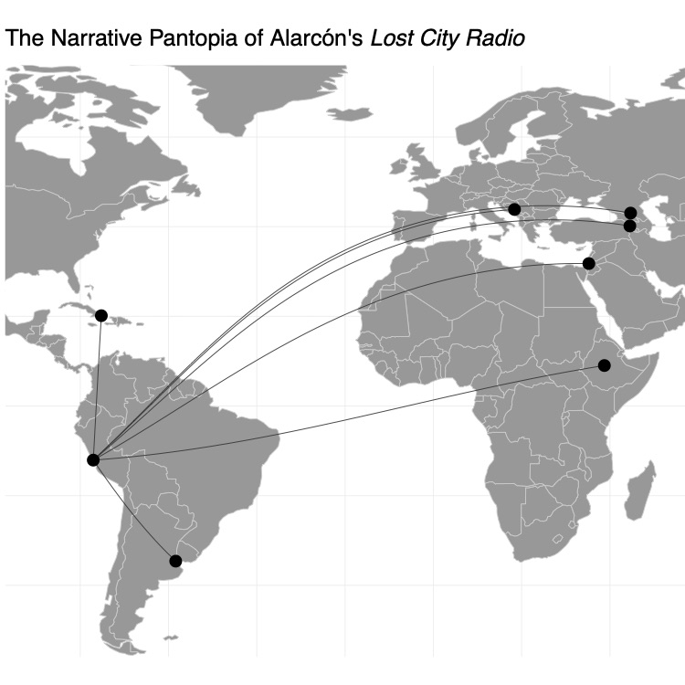

# Introduction to R

.center[Source: Much of this is is borrowed from [UBC's Stat545](https://stat545guidebook.netlify.com/)]

* Today, we'll get you up to speed with a minimum "need to know" about using R and RStudio. 

* I'm going to assume you know nothing.

* The format of today's notes aim to teach R by exploration 

* These are mostly all exercises we'll be doing together in class. 

---

# Why R?

Some points taken from [adv-r: intro](http://adv-r.had.co.nz/Introduction.html):

- Free, platform-wide
- Open source
- Comprehensive set of "add on" packages for analysis
- Huge community
- Scripting language
- Makes pretty graphics (much better than other options)
- Highly extensible to do lots of things
- ...

Alternatives exist for data analysis, `python` being another excellent tool
---

# Will this help?

.pull-left[

* I made this graphic for my wife who works in Spanish Literature

* A friend in college did linear regression for a French linguistics assignment

* My roommate who studied music produced some summary statistics for a music theory project

* Business majors write reports with graphics and calculations

* These things can be done in Excel, but R is better
]

.pull-right[

]

---

# Issues R can avoid

* You saw the reproducibility/Reinhart+Rogoff issue

* Science retracted a study of how canvassers can sway people’s opinions about gay marriage published just 5 months earlier
    - Science Editor-in-Chief Marcia McNutt: Original survey data not made available for independent reproduction of results. + Survey incentives misrepresented. + Sponsorship statement false.
    - Two Berkeley grad students who attempted to replicate the study quickly discovered that the data must have been faked.
    - Source: http://news.sciencemag.org/policy/2015/05/science-retracts-gay-marriage-paper-without-lead-author-s-consent
    
---

# More...

* Seizure study __Low Dose Lidocaine for Refractory Seizures in Preterm Neonates__ retracted
    - “The article has been retracted at the request of the authors. After carefully re-examining the data presented in the article, they identified that data of two different hospitals got terribly mixed. The published results cannot be reproduced in accordance with scientific and clinical correctness.”
    - Source: http://retractionwatch.com/2013/02/01/seizure-study-retracted-after-authors-realize-data-got-terribly-mixed/


* Bad spreadsheet merge kills depression paper
    - The authors informed the journal that the merge of lab results and other survey data used in the paper resulted in an error regarding the identification codes. 
    - Results of the analyses were based on the data set in which this error occurred. Further analyses established the results reported in this manuscript and interpretation of the data are not correct.
    - Original conclusion: Lower levels of CSF IL-6 were associated with current depression and with future depression […].
    - Revised conclusion: Higher levels of CSF IL-6 and IL-8 were associated with current depression […].
    - Source: http://retractionwatch.com/2014/07/01/bad-spreadsheet-merge-kills-depression-paper-quick-fix-resurrects-it/

---

# Will this hurt?

.center[Almost certainly not.]


---

# Learning Objectives

By the end of today's class, students are expected to be able to:

- Write an R script to perform simple calculations

- Access the R documentation on an as-needed basis

- Use functions and operators in R

- Subset vectors in R

- Explore a data frame in R

- Load packages in R

---

# Install R and Rstudio

.pull-left[
R is a programming language
  - It isn't on your computer
  - Go to [r-project.org](https://www.r-project.org)
  - Select Version 3.6.2 and the appropriate operating system

  
]
  
.pull-right[  
Rstudio is a nice interface to R
  - Called an IDE (integrated development environment)
  - Makes it easier to use R
  - Go to (http://rstudio.com/)[rstudio.com]
  - Download the Free, Desktop version
  - Start Rstudio, you'll see some panes
]

.center[.purple[.bigger[Engage!]]]

---

# In-class 3

1. Start a new R script in RStudio

2. add your exploratory code to the script as we work through the exercises. 

3. What you write on this script doesn't have to be exactly the same as what I write 

4. Upload the script to Canvas (In-class 3) at the end of the period.

---

class: middle, center, inverse

# Quick orientation

---

# Using R and RStudio

.pull-left[
Let's try these exercises as our first steps.

1. Try some arithmetic from a script vs. the console. 
    - Notice that your commands appear in the "History" tab. 
    - Do not rely on this! What do you think is better than relying on the history?

2. Store a number in a variable called `number` using `<-` (read this arrow as "gets").
    - Notice that the object appears in the "Environment" tab in the top-right of RStudio.

3. Try some arithmetic on the variable.

4. Try some arithmetic on an undefined variable.

]

--

.pull-right[
```{r, error=TRUE}
2+3
4/6
number <- 273.925
number + 14
other_number + 14
```
]

---

# Vectors

.pull-left[

* _Vectors_ store multiple entries of a data type, like numbers. 

* You'll discover that they show up just about everywhere in R.

* Let's collect some data and store this in a vector called `times`. How long was your commute this morning, in minutes?

* Operations happen component-wise. 

* Let's calculate those times in hours. 

* How can we "save" the results?
]

--

.pull-right[

```{r}
times <- c(17,3, 33, 28, 15, 10)
times / 60
times_in_hrs <- times/60
times_in_hrs
```


]

---

# Functions, Part I 

.pull-left[
* What's the average travel time? 

* Instead of computing this manually, let's use a _function_ called `mean()`. 

* Notice the syntax of using a function: the _input_ goes inside parentheses.

* We _input_ `times`, and got some _output_. 

* Did this function change the input? 

* Aside from some bizarre functions, this is always the case. 

* Functions don't always return a single value. 

* Try the `range()` function, for example. What's the output? 

* What about the `sqrt()` function?
]

--

.pull-right[
```{r}
mean(times)
times
mean(x=times)
range(times)
round(sqrt(times), 2)
```
]
---

### Comparisons

.pull-left[
We'll now introduce _logicals_.

* Which of our travel times are less than (say) 30 minutes? Use `<`.

* Which of our travel times are equal to ... (pick something)? What about _not_ equal to it? Notice the use of `==` as opposed to `=` -- why do you think that is?

* Which of our travel times are greater than ...(lower)... _and_ less than ...(upper)...? What about less than ...(lower)... _or_ greater than ...(upper)...?

* Some functions expect logical inputs. Try using the `which()` function on one of the above. What about `any()`? `all()`?

* Logicals can be explicitly specified in R with `TRUE` and `FALSE`.
]

.pull-right[.even-smaller[

```{r}
times < 15
times == 17
times > 5 & times < 17
times > 5 | times < 17
which(times < 15); any(times < 15)
all(times < 15)
```

]]

---

# Subsetting 

.pull-left[
Use `[ ]` to subset the vector of `times`:

1. Extract the third entry.

2. Extract everything except the third entry.

3. Extract the second and fourth entry. The fourth and second entry.

4. Extract the second through fifth entry -- make use of `:` to construct sequential vectors.

4. Extract all entries that are less than 30 minutes. Why does this work? Logical subsetting!

]

.pull-right[
```{r}
times[3]
times[-3] # This is a comment
times[c(2,4)]
times[2:5]
times[times < 30]
```
]

---

# More subsetting

.pull-left[
After all of that, did our `times` object change at all?

We can use `[ ]` in conjunction with `<-` to change the `times` object:

1. Replace two entries with new travel times.

2. "Cap" entries that are "too large" at some set value. If this is more than one value, why don't we need to match the number of values? Recycling!

3. Remove an entry, by overwriting `times`.
]

--

.pull-right[
```{r}
times[c(2,4)] = c(27, 52)
times
times[times > 25] = 25
times
times = times[-2]
times
```

]


---

# NA's

.pull-left[

Sometimes we have missing data. Those entries are replaced with `NA` in R. Be careful with these!

1. Add `NA` to the vector of times.

2. What's the mean of this new vector of times?

Let's expand our view of functions in order to solve this problem.
]

--

```{r}
times[2] = NA
mean(times)
```
---

# Functions, Part II

.pull-left[
Functions can take many _arguments_ 

Access the documentation of the `mean()` function by executing `?mean`. 

- There are four arguments.
- All the arguments have names, except for the `...` argument  This is always the case. 
- Under "Usage", some of the arguments are of the form `name = value`.
    - These are default values, in case you don't specify these arguments.
    - This is a sure sign that these arguments are _optional_. 
- `x` is "on its own". This typically means that it has no default, and often (but not always) means that the argument is _required_. 

]

---

# Functions, Part II

.pull-left[

We can specify an argument in one of two ways:

- specifying argument `name = value` in the function parentheses; or

- matching the ordering of the input with the ordering of the arguments.

- For readability, this is not recommended beyond the first or sometimes second argument! 

Input `TRUE` for the `na.rm` argument in both ways.

]

--

.pull-right[
```{r}
mean(times, na.rm=TRUE)
mean(times, ,TRUE) # works, but weird
mean(x=times)
```
]

---

# Data frames


Living in a vector-only world would be nice if all data analyses involved one variable. 

When we have more than one variable, _data frames_ come to the rescue. Basically, a data frame holds data in tabular format. Think Excel spreadsheet, but better

R has some data frames "built in". For example, motor car data is attached to the variable name `mtcars`. 

Print `mtcars` to screen. Notice the tabular format. 

--

```{r}
mtcars
```

---

# Your turn


.pull-left[
1. Use some of these built-in R functions to explore `mtcars`, without printing the whole thing to screen:
    - `head()`, `tail()`, `str()`, `nrow()`, `ncol()`, `summary()`, `row.names()` `names()`.

  Notice that `names` and `row.names()` outputs a _character vector_ (we've already seen numeric and logical vectors). 

1. What's the first column name in the `mtcars` dataset? 

1. Which column number is named `"wt"`?

  Each column is its own vector that can be extracted using `$`. For example, we can extract the `cyl` column with `mtcars$cyl`.

1. Extract the vector of `mpg` values. What's the mean `mpg` of all cars in the dataset?
]

--

.pull-right[
```{r}
nrow(mtcars); ncol(mtcars)
names(mtcars)[1]
which(names(mtcars)=='wt')
mean(mtcars$mpg)
with(mtcars, mean(mpg))
```

]

---

# R packages

The functions that "come with" R are not enough to do an analysis. 

In come R _packages_ to the rescue. 

These are "add ons", each coming with their own  functions and objects, usually designed to do one type of task. 

[CRAN](https://cran.r-project.org/) stores packages that, for all intents and purposes, can be considered "official" R packages. 

It's easy to install packages from CRAN! Just use the `install.packages()` function. 

Run the following lines of code to install the `tidyverse` and `gapminder` packages. (But don't include this in your scripts -- it's not very nice to others who may have already installed)

```{r, eval=FALSE}
install.packages("tibble")
install.packages("gapminder")
```

- `tibble`: a package that makes data frames a bit nicer
- `gapminder`: a package that makes the gapminder dataset available (as a `tibble`!)

---

# Post install

Installing a package is not enough! 

To access its functions, you have to _load_ it. 

Use the `library()` function to load a package. 

Run the following lines of code to load the packages. (Do put these in your scripts, and near the top)

```{r}
library(tibble)
library(gapminder)
```

Take a look at the packages under the "Global Environment" tab to see the new objects that have just been made available to us. 

PS: you'll notice `mtcars` is not in our workspace/environment, yet we can still access it -- where does `mtcars` live?

---

# Extra package stuff

.pull-left[
Try the following two approaches to access information about the `tibble` package.

Run the lines one-at-a-time. Vignettes are your friend, but do not always exist. 

```
?tibble
browseVignettes(package = "tibble")
```

Print out the `gapminder` object to screen. It's a tibble -- how does it differ from a data frame in terms of how it's printed?

Because a tibble is a data frame, our exploration functions still work on it. Try some.
]

.pull-right[.smaller[

```{r}
gapminder
mean(gapminder$lifeExp)
mean(gapminder$lifeExp[
  gapminder$country=='United States'])
```
]]

---

# Finishing up 

Highly recommended: 

[Don't save your workspace](https://www.r-bloggers.com/using-r-dont-save-your-workspace/) when you quit RStudio. Make this a default:

    - Go to "RStudio" -> "Preferences..." -> "General"
    - Uncheck "restore .RData into workspace on startup"
    - Select: "Save workspace to RData on exit:" Never
    
Much better to save a script `named-code.R` that creates your analysis

Upload your script to Canvas (ic3-r-intro).