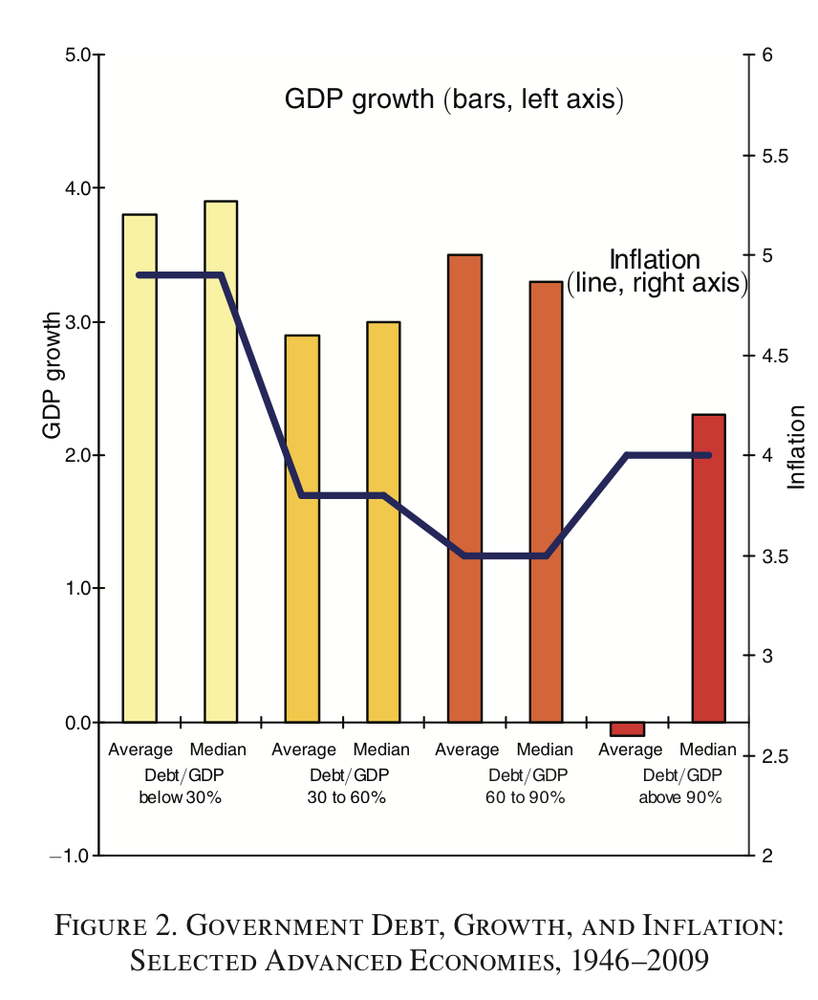

class: middle, center

## Reminder: Class on Thursday is next door

Also, don't forget to do your news article before Spring break.

---

# Today's news


.center[.bigger[
[How deadly will it get?](https://www.nytimes.com/interactive/2020/world/asia/china-coronavirus-contain.html#virulence)
]]

---

class: inverse, middle, center

.bigger[
# Struck by Lightning - The End
]


---

# Monty Hall

.pull-left[

]

.pull-right[

]


---

# The problem

1. There are three doors. Goats are behind 2. A car is behind the third. You keep what you choose.

1. You choose a door. The host (Monty) opens a door that you didn't choose, revealing a goat.

1. You are asked whether you wish to switch doors.


---

# More doors

1. Suppose there are lots of doors (only one contains the car).

1. The host opens "all the doors except one"

1. Do you switch doors?

---

# Problems with the problem

<blockquote cite="Crucial assumption">If the host has a choice between 2 doors to open, he (Monty) opens them randomly with equal probability.</blockquote>

.pull-left[.center[
## Monty Crawl

## Monty Fall
]]
.pull-right[


]

---

# Do you believe it yet?

.center[

]


---

class: inverse, middle, center

.bigger[
# The Signal and The Noise - The Beginning
]

---

.middle[.center[
<iframe src="https://www.bbc.co.uk/ideas/videos/are-you-a-hedgehog-or-a-fox/p07f9xl9/player" width="1000" height="880" scrolling="no" style="overflow: hidden" allowfullscreen frameborder="0"></iframe>
]]

---

# Today's news


.center[
[How much football is there?](https://fivethirtyeight.com/features/how-much-football-is-even-in-a-football-broadcast/)


]

---

class: middle, center, inverse

# Aside on Reinhardt and Rogoff (pp. 39-40)

---

# Reinhardt and Rogoff

.pull-left[
* Both Chaired Professors at Harvard

* "Growth in a time of debt" (2010) AER

* Central idea: 

"If debt/GDP > 90%, GDP growth goes negative"
]

.pull-right[


]

---

# Define terms

* GDP = Gross domestic product, how much stuff a country produces

* Negative GDP _growth_ for 6 months is called a __recession__

* Recessions are bad

<blockquote cite="Reinhart and Rogoff (2010)">Our main findings are: First, the relationship between government debt and real GDP growth is weak for debt/GDP ratios below a threshold of 90 percent of GDP. Above 90 percent, median growth rates fall by one percent, and average growth falls considerably more.</blockquote>

---

class: center



---

# Impact

1. Evidence presented before Senate budget committee

1. Cited in 76+ media reports at the time (NYTimes, Fox News, Wall Street Journal, etc.)

1. Cited by 3269 academic papers

1. Paul Ryan’s budget: "The study found conclusive empirical evidence that gross debt (meaning all debt that a government owes, including debt held in government trust funds) exceeding 90 percent of the economy has a significant negative effect on economic growth." (Ryan 2013 p. 78)

1. Support for the European “austerity” agenda imposed on numerous countries in southern Europe, Africa, Central and South America

1. Greece and other countries drastically cut government spending leaving millions unemployed

---

<iframe src="//media.mtvnservices.com/embed/mgid:arc:video:comedycentral.com:e352ee4d-8b94-4fde-bb2c-c9971a9e3264" width="1024" height="596" frameborder="0" allowfullscreen="true"></iframe>

---

<iframe src="//media.mtvnservices.com/embed/mgid:arc:video:comedycentral.com:29bd1878-48ec-45c0-9477-75b9dc833f97" width="1024" height="596" frameborder="0" allowfullscreen="true"> 


---

class: middle,center

```{r, echo=FALSE,message=FALSE,fig.width=14,fig.height=8}
## See the below RR.R, this script is a subset thereof
RR = foreign::read.dta("data/HAPData/RR-processed.dta")
RR <- subset(RR,  !is.na(dRGDP) & !is.na(debtgdp))
RR$dgcat.lm <- cut(RR$debtgdp, breaks=c(0,30,60,90,Inf))
RR$dgcat <- factor(RR$dgcat.lm, labels = c("0-30%","30-60%","60-90%","Above 90%"),ordered=TRUE)

ggplot(RR, aes(x=debtgdp,y=dRGDP)) + 
  geom_vline(xintercept=90,color='lightgray',size=3.5) +
  geom_point(aes(color=dgcat), alpha=.6, size=4) + 
  ylab("Real GDP Growth") + xlab("Public Debt/GDP Ratio") + 
  scale_x_continuous(breaks=seq(0,240,30)) + theme_cowplot(28) +
  geom_smooth(color="black") +
  geom_hline(yintercept = 0, linetype="dashed") +
  theme(legend.title = element_blank())
```

---

# Lessons

* Selective data exclusion – ignored some “outliers” which would alter the results

* Weighted the data strangely 

* Arbitrary “binning”

* Excel is dangerous: easy to screw up, but hard to catch

* RR never said "high debt CAUSES recession", but the media did


---
class: inverse, center, middle

# Weekly concepts


---

# Weekly concepts


