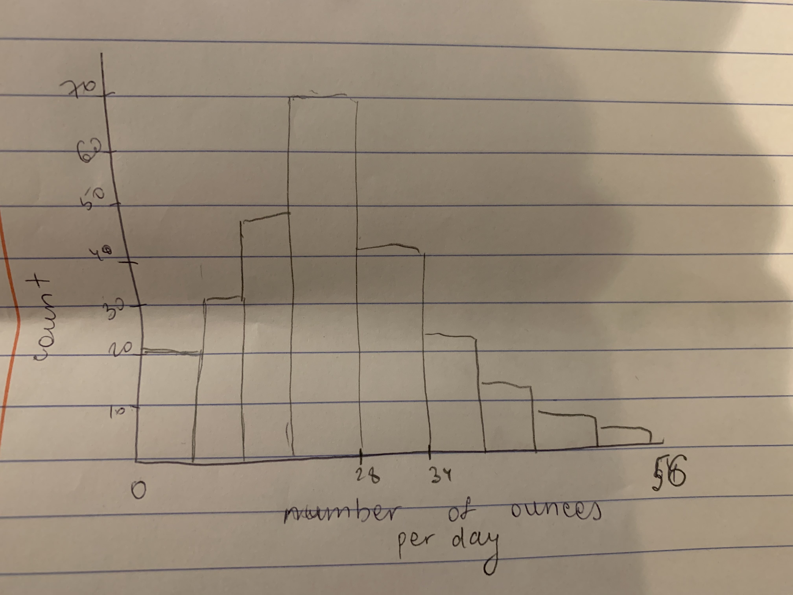

# Key ingredients for science

<blockquote cite="NYTimes">...some researchers who specialize in studying diseases that spill over from animals to humans have expressed frustration about conducting discussions about scientific claims without the life breath of science: publicly available data and accounts of how the research was done that have been vetted by other scientists.</blockquote>

.pull-left[.center[.middle[
[Pangolins and Coronavirus](https://www.nytimes.com/2020/02/10/science/pangolin-coronavirus.html?smtyp=cur&smid=fb-nytimes&fbclid=IwAR22kUpILsje8S1NUSFf3uZmBbceVpn80Pw_1np4i_ddeVGjLoBNw1ovMjA)
]]]

.pull-right[

]


---
class: inverse, center, middle

# Weekly concepts (last week)


---

# Weekly concepts (last week)

* Proportionality principle

* Sample space

* Foxy forecasting

* Reproducible research

* Peer review

* Mean vs Median

---

# Today's news

[Return of COVID-19](https://www.nytimes.com/2020/02/13/world/asia/coronavirus-risk-interpreter.html?action=click&module=Top%20Stories&pgtype=Homepage)

---

# Hurricane tracks

.pull-left[

]

.pull-right[
<blockquote class="twitter-tweet"><p lang="en" dir="ltr">This was the originally projected path of the Hurricane in its early stages. As you can see, almost all models predicted it to go through Florida also hitting Georgia and Alabama. I accept the Fake News apologies! <a href="https://t.co/0uCT0Qvyo6">pic.twitter.com/0uCT0Qvyo6</a></p>&mdash; Donald J. Trump (@realDonaldTrump) <a href="https://twitter.com/realDonaldTrump/status/1169375550806351872?ref_src=twsrc%5Etfw">September 4, 2019</a></blockquote> <script async src="https://platform.twitter.com/widgets.js" charset="utf-8"></script>
]

---

# All the figures

[Timeseries of paths](https://www.nhc.noaa.gov/archive/2019/DORIAN_graphics.php?product=5day_cone_with_line)


---

# Forecast errors


.center[

]

---


# Histogram

```{r, message=FALSE, echo=FALSE, fig.width=12, fig.align='center', fig.height=6}
library(tidyverse)
library(cowplot)
sex = read_csv("data/SexStudy.csv")
ggplot(sex, aes(study.sex)) + 
  geom_histogram(fill="orange", bins=10) +
  theme_cowplot(26) + xlab("probability of sex") +
  scale_y_continuous(expand = expand_scale(0)) +
  scale_x_continuous(expand = expand_scale(0))
```


.green[
Source: Study conducted by George Loewenstein at CMU. Data consists of 64 married couples.
]

---

# In class exercise

* In pairs, 
  1. Guess the average (mean) beer consumption (in ounces) per day in the US
  
  2. Guess the median beer consumption (in ounces) per day in the US
  
  3. Draw a histogram (by hand), with ounces consumed per day on the x-axis and count/frequency on the y-axis. 


--

* Report your best guess for 
  1. ounces of beer .green[YOU] consume per day (average) and 
  
  1. ounces of beer .green[YOUR FRIENDS] consume per day (average)
  
  
---

# Beer results

* 270 Million adults over 21 in the US

* About 62% drink alcohol

* Americans consume 24,245,000,000 litres per year

* So the average among those who drink is something like `r round((24245*35.19) / (270*.62*365),2)`

* In BC, beer is sold in "sleeves" which are approximately this amount

---

# Results from class

```{r, echo=FALSE}
personal = c(0,0,17, 20, 1,0,0,0,.1,0,0,24,0)
friends = c(12,24,90,100,20,26,24,10,20,10,0,48,28)
gmean = c(34,20,36,20,27)
gmed = c(28,12,20,0,25)
```

* Guesses for mean: `r sort(gmean)`

--

* Guesses for median: `r sort(gmed)`

* Everyone had median $<$ mean

---

# Typical histogram

.center[

]

---

# Personal consumption 1

```{r, echo=FALSE,warning=FALSE,fig.width=12,fig.height=7,message=FALSE}
tibble(personal) %>% 
  ggplot(aes(personal)) + geom_histogram(aes(fill='orange')) +
  scale_y_continuous(
    breaks = 0:10,
    limits=c(0,10), 
    expand = expand_scale(0)) +
  theme_cowplot(26) + theme(legend.position = 'none')
```


---


# Personal consumption 2

```{r, echo=FALSE,warning=FALSE,fig.width=12,fig.height=7,message=FALSE}
tibble(personal) %>% filter(personal > 0) %>% 
  ggplot(aes(personal)) + geom_histogram(aes(fill='orange')) +
  scale_y_continuous(limits=c(0,10), expand = expand_scale(0),breaks=0:10) +
  annotate(x=0,y=0,xend=0,yend=sum(personal==0),geom = "segment",color='blue')+
  theme_cowplot(26) + theme(legend.position = 'none')
```

---

# Issues 

--

* Real data: https://www.niaaa.nih.gov/procedures-obtaining-dataset

* Survey of about 50,000 adults

* Anyone with proper privacy controls can access it

* I do not have proper controls

---

# Wet-biasing

* Evidence in Chapter 4.

* Who is being compared?

* Why does the Weather Channel do something different that the government?

* Is this a good idea?

* Who produces more accurate forecasts?

---

# Power laws

* The "Gutenberg-Richter" is an example of a "power-law" relationship

* What is a power-law relationship?

* What other phenomena have this relationship (approximately or exactly)?


---

# Things people say are "power law"

1. The frequency of occurrence of unique words in the novel Moby Dick by Herman Melville [44].
1. The degrees (i.e., numbers of distinct interaction partners) of proteins in the partially known protein-interaction network of the yeast Saccharomyces cerevisiae [29].
1. The degrees of metabolites in the metabolic network of the bacterium Escherichia coli [27].
1. The degrees of nodes in the partially known network representation of the Internet at the level of autonomous systems for May 2006 [26]. 
1. The number of calls received by customers of AT&T’s long distance telephone service in the United States during a single day [1, 5].
1. The intensity of wars from 1816–1980 measured as the number of battle deaths per 10000 of the combined populations of the warring nations [54, 50].
1. The severity of terrorist attacks worldwide from February 1968 to June 2006, measured as the number of deaths directly resulting [12].
1. The number of bytes of data received as the result of individual web (HTTP) requests from computer users at a large research laboratory during a 24-hour period in June 1996 [69]. Roughly speaking this distribution represents the size distribution of web files transmitted over the Internet.
1. The number of species per genus of mammals. This data set, compiled by Smith et al. [55], is composed primarily of species alive today but also includes some recently extinct species, where “recent” in this context means the last few tens of thousands of years.
1. The numbers of sightings of birds of different species in the North American Breeding Bird Survey for 2003.
1. The numbers of customers affected in electrical blackouts in the United States between 1984 and 2002 [44].

---

# Over-fitting vs. Under-fitting


.pull-left[
* Bias

* Variance

* Complexity and quantity of data

* Bias-Variance tradeoff
]

.pull-right[
```{r,fig.height=12, fig.width=12, echo=FALSE, message=FALSE}
cols = c("blue", "red", "green", "orange")

par(mfrow=c(2,2),bty='n',ann=FALSE,xaxt='n',yaxt='n',family='serif',mar=c(0,0,0,0),oma=c(0,4,4,0))
require(mvtnorm)
mv = matrix(c(0,0,0,0,-.5,-.5,-.5,-.5),4,byrow=T)
va = matrix(c(.01,.01,.5,.5,.05,.05,.5,.5),4,byrow=T)

for(i in 1:4){
  plot(0,0,ylim=c(-2,2),xlim=c(-2,2),pch=19,cex=70,col="blue",ann=FALSE,pty='s')
  points(0,0,pch=19,cex=50,col='white')
  points(0,0,pch=19,cex=30,col="green")
  points(0,0,pch=19,cex=10,col="orange")
  points(rmvnorm(20,mean=mv[i,],sigma=diag(va[i,])), cex=2, pch=19)
  switch(i, 
         '1'= {
           mtext('low variance',3,cex=5)
           mtext('low bias',2,cex=5)
         },
         '2'= mtext('high variance',3,cex=5),
         '3' = mtext('high bias',2,cex=5)
  )
}
```
]

---

# Economic forecasting

<blockquote cite="Signal and the Noise, p. 200">Economic forecasts produced by the White House...have historically been among the least accurate of all.</blockquote>

* (regardless of party)

* Why?

* What are the incentives?

---

# Correlation vs. Causation

<blockquote>From 1967 to 1997, the winner of the Super Bowl (specifically, whether the winner was from the original NFL or the original AFL) was strongly correlated with economic performance for the rest of the year.</blockquote>


--

<blockquote cite="My father in-law, on Monday">Chicago banned guns and has 1105 murders. Maine has no gun restrictions and only 100 murders.</blockquote>

--

* What else is wrong about this statement in terms of other concepts we have discussed?

---

# Graphical model

.pull-left[
```{r, fig.align='center', fig.retina=3, echo=FALSE, message=FALSE}
library(visNetwork)
library(widgetframe)
tnodes = tibble(id=1:2,label=c("guns","crime"), shape="circle")
tedges = tibble(from=1,to=2)
vn = visNetwork(tnodes,tedges) %>%
  visEdges(arrows = "to")
frameWidget(vn, height=400)
```
]


.pull-right[
```{r, fig.align='center', fig.retina=3, echo=FALSE}
tnodes = tibble(id=1:2,label=c("guns","crime"), shape="circle")
tedges = tibble(from=2,to=1)
vn = visNetwork(tnodes,tedges) %>%
  visEdges(arrows = "to")
frameWidget(vn, height=400)
```
]

---

# Graphical model
```{r, fig.align='center', fig.retina=3, echo=FALSE}
tnodes = tibble(id=1:3,label=c("guns","crime","???"), shape="circle")
tedges = tibble(from=c(1,3,3),to=c(2,2,1))
vn = visNetwork(tnodes,tedges) %>%
  visEdges(arrows = "to")
frameWidget(vn, height=400)
```


---

# Today's news


[Chocolate and Cognition](https://www.nejm.org/doi/full/10.1056/NEJMon1211064)


---
class: inverse, center, middle

# Weekly concepts


---

# Weekly concepts

* Forecast horizon

* Forecast uncertainty

* Model averaging

* Mean/Median

* Histogram

* Bias

* Variance

* Over-fitting and Under-fitting

* Power law

* Correlation vs. Causation

* Hidden common causes